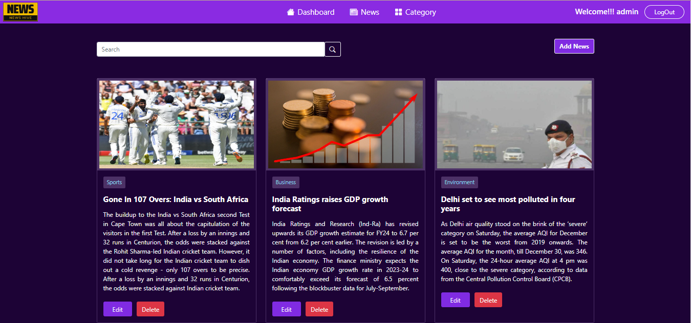
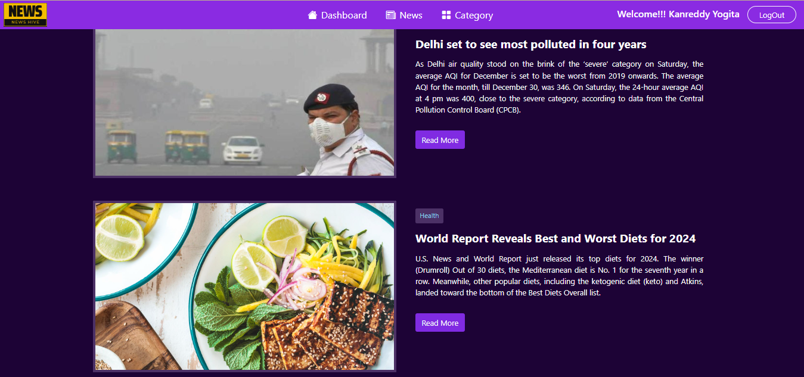

# NewsHive

Welcome to the NewsHive (News Portal using PHP and MySQL). This web application allows you to manage and browse news contents. It has been developed using HTML, CSS, Bootstrap, PHP, and MySQL. 
The system includes two roles: Admin and Users.

## Features

### Admin Role

- **Full Content Control:** Admins have complete control over news content.
- **Edit, Delete, and Add News:** Admins can edit existing news articles, delete them, and add new articles with ease.

### User Role

- **Browse News Content:** Users can browse through the available news articles.
- **Add News:** Users have the ability to contribute by adding their news articles.

## Technologies Used

- HTML
- CSS
- Bootstrap
- PHP
- MySQL

## Getting Started

### Prerequisites

- XAMPP Web server (e.g., Apache)
- PHP 8.x
- MySQL database
- Bootstrap 5.x

### Installation

1. Clone the repository:

   ```bash
   git clone https://github.com/your-username/news-portal-project.git

### Screenshots





### Usage

1. Access the application and create an account.
2. Log in with your credentials.
3. Admins will have access to the full range of content management features.
4. Users can browse existing news content and contribute by adding their news articles.
